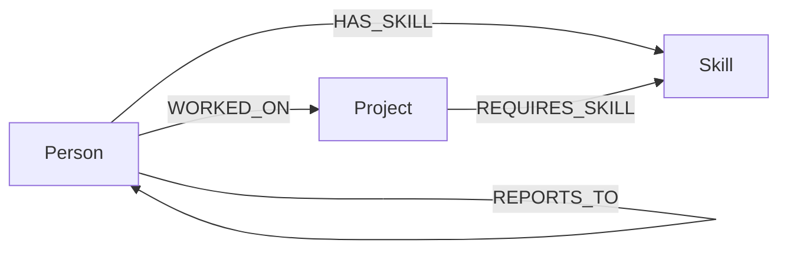

# Skill Graph

A staffing network app: it maps who knows what, who's worked with whom, and how a
needed skill travels through an engineering org — even when the closest person to
it isn't the one you'd think to ask. Built on **CognoDB** (openCypher over Bolt)
with a NestJS API and a React frontend.

**Live demo:** _add your hosted URL here after deploying_
**Screen recording:** _add your recording link here_

---

## 1. The use case

Imagine a mid-size software consultancy staffing new projects. The natural
questions a staffing lead actually asks are relational, not tabular:

- "Who can build this?" → who has the required skills, at the required level.
- "Who could pick this skill up fastest?" → who hasn't done it yet but has
  worked alongside someone who has.
- "If I put these three people together, will they gel?" → have they shipped
  something together before.
- "What's the shortest route from this person to that skill?" → through
  whatever mix of colleagues and past projects connects them.

None of these are naturally row-shaped. They're all questions about paths and
neighborhoods in a network of people, skills, and projects — which is exactly
what a graph database is for.

### Why a graph database?

A relational schema for this domain needs at least four join tables
(`person_skill`, `person_project`, `project_skill`, `person_manager`), and the
interesting questions all require walking through more than one of them at
once:

- **"Who has this skill, or is one collaboration away from it?"** is a
  self-join of `person_project` against itself (find co-workers) joined again
  to `person_skill`. In Cypher it's a single pattern:
  `(target)-[:WORKED_ON]->(:Project)<-[:WORKED_ON]-(colleague)-[:HAS_SKILL]->(:Skill)`
  — see [`PeopleService.findSkillInNetwork`](backend/src/people/people.service.ts).
- **"Suggest a team that already has working chemistry"** needs, for every
  candidate, a count of *other* qualified candidates they've previously
  shared a project with — a multi-hop aggregation that in SQL means a
  self-join through the membership table per skill, per project, recomputed
  for every candidate pair. In Cypher it's one `MATCH` plus a `count()` — see
  [`ProjectsService.suggestTeam`](backend/src/projects/projects.service.ts).
  This is the query a relational schema would find genuinely awkward.
- **"What's the shortest path from this person to a skill they don't have?"**
  is a variable-length traversal of unknown depth. SQL answers this with a
  recursive CTE that has to guess a maximum depth and re-scans the join
  tables at every level. Cypher has `shortestPath()` built into the query
  language — see
  [`PeopleService.shortestPathToSkill`](backend/src/people/people.service.ts).

The schema is also additive: adding a new relationship type (e.g. `ENDORSED`
or `MENTORS`) is a new edge, not a migration and a new join table.

---

## 2. Data model



**Nodes**

| Label     | Key properties                                              |
|-----------|--------------------------------------------------------------|
| `Person`  | `id`, `name`, `title`, `seniority`, `bio`, `avatarColor`      |
| `Skill`   | `id`, `name`, `category`                                     |
| `Project` | `id`, `name`, `description`, `domain`, `status`, `startDate`, `endDate` |

**Relationships**

| Type              | Direction              | Properties          | Meaning |
|-------------------|-------------------------|----------------------|---------|
| `HAS_SKILL`       | `Person → Skill`        | `level` (1–5), `years` | a person's proficiency in a skill |
| `WORKED_ON`       | `Person → Project`      | `role`               | project membership / history |
| `REQUIRES_SKILL`  | `Project → Skill`       | `minLevel`           | staffing requirement |
| `REPORTS_TO`      | `Person → Person`       | —                    | management chain |

Seed data (`backend/seed/data.ts`): 16 people, 21 skills across 7 categories,
10 projects, and the relationships wiring them together — enough to
demonstrate multi-hop traversal without needing synthetic bulk data.

---

## 3. Set up CognoDB Cloud

1. Sign up at [console.cognodb.com/signup](https://console.cognodb.com/signup) (no credit card needed).
2. Create a free `c0` instance and pick a region.
3. Copy the `bolt+s://<instance-id>.databases.cognodb.cloud` URI and the
   generated password for user `cognodb` — **the password is shown once.**

---

## 4. Run it locally

### Backend

```bash
cd backend
cp .env.example .env
# edit .env with your NEO4J_URI / NEO4J_USERNAME=cognodb / NEO4J_PASSWORD
npm install
npm run seed        # loads people/skills/projects into your CognoDB instance
npm run start:dev   # API on http://localhost:4000
```

### Frontend

```bash
cd frontend
cp .env.example .env   # VITE_API_URL=http://localhost:4000
npm install
npm run dev             # app on http://localhost:5173
```

Visit `http://localhost:5173`. If the database is unreachable, the app shows
a banner rather than failing silently (see `HealthBanner.tsx` and the global
exception filter in `backend/src/common/http-exception.filter.ts`).

### Deploying

- **Backend**: any Node host with env vars (Render, Railway, Fly.io free
  tiers all work). Set `NEO4J_URI`, `NEO4J_USERNAME`, `NEO4J_PASSWORD`,
  `CORS_ORIGIN` (your deployed frontend URL).
- **Frontend**: any static host (Vercel, Netlify). Set `VITE_API_URL` to your
  deployed backend URL at build time.
- Keep the CognoDB instance running after deploying — the assignment asks
  for it to stay up in case of a live review.

---

## 5. Main queries, explained

All queries are parameterized via the official Neo4j JS driver
(`neo4j-driver`), never string-concatenated — see `Neo4jService.read` /
`.write` in `backend/src/neo4j/neo4j.service.ts`, which every resource
service calls through.

1. **Person profile** (`people.service.ts: getProfile`) — one person, their
   skills, project history, and manager, via three `OPTIONAL MATCH`es and an
   aggregation. Single-hop, but three of them combined in one round trip.

2. **Ego-network graph** (`getNetworkGraph`) — a 2-hop traversal from a
   person out to their direct skills/projects (hop 1) and colleagues reached
   through a shared project (hop 2). Powers the force-directed graph view.

3. **Skill-in-network search** (`findSkillInNetwork`) — *"does someone I've
   worked with have this skill, even though I don't?"* A 2-hop pattern with a
   `NOT` exclusion on the direct case. Try it on a junior engineer's profile
   page against a senior-only skill like Kubernetes.

4. **Shortest path to a skill** (`shortestPathToSkill`) — variable-length
   `shortestPath()` between a person and a skill node, mixing `WORKED_ON` and
   `HAS_SKILL` edges. Demonstrates a query shape SQL fundamentally struggles
   with at arbitrary depth.

5. **Team suggestion** (`projects.service.ts: suggestTeam`) — for each of a
   project's required skills, finds qualified candidates and scores them by
   how many other qualified candidates they've already collaborated with.
   The flagship "awkward in SQL" query — see the Why section above.

6. **Global search** (`search.service.ts`) — fans out across `Person`,
   `Skill`, and `Project` by name in one round trip using `CALL { … }`
   subqueries.

Every one of these is visible from the UI itself: network views and the team
suggestion panel have a **"View the Cypher behind this"** toggle that shows
the exact query that ran.

---

## 6. Project structure

```
backend/
  src/
    neo4j/          Neo4jService — driver connection, read/write helpers, error handling
    people/         profile, ego-network, multi-hop skill search, shortest path
    projects/       project detail, team-suggestion query
    skills/         skill detail, 2-hop "who could learn this next" graph
    search/         cross-entity search
    common/         global exception filter
  seed/             seed data + load script
frontend/
  src/
    api/client.ts        typed fetch wrapper
    components/          NetworkGraph (d3-force), CypherPanel, shared states
    pages/                one page per route
docs/                     (add data-model / screenshot images here)
```

## 7. Error handling

- `Neo4jService` never crashes the API if CognoDB is unreachable at boot —
  it logs and surfaces a `503` per request instead.
- The frontend's `HealthBanner` checks `/api/health` on load and shows a
  clear, actionable message if the database is down.
- Every page has a distinct loading (skeleton), empty, and error state —
  see `frontend/src/components/States.tsx`.

## 8. Screenshots

_Add screenshots of the home page, a person's network view, and the team
suggestion panel here before submitting._
